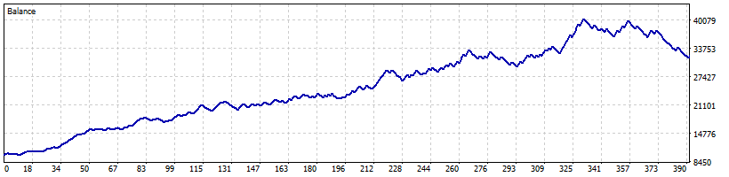
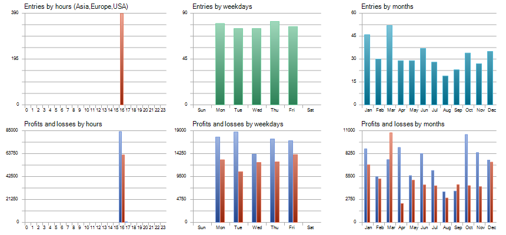

# session-open-bot

This trading bot is designed to be ran when the New York Stock Exchange opens.

At this opening, there is a massive surge in volatilty, which is what this bot aims to capitalise on. It will look to the previous candle's highs and lows and determine based upon research into the seasonality of the US30 index, the best parameters to be used. Once the NYSE has opened, the buy stops and sell stops are placed into their calculated positions. All parameters related to the trades have been hard coded, including the risk-to-reward.

If the buy stops have activated, then the sell stops are automatically removed and vice versa. This decision was made based upon backtesting data and optimisations. Furthermore, all orders are placed to expire at the end of the trading session, therefore if they have not been placed by then, they are automatically removed.

To run this algorithm, add it to your cTrader platform (preferably ICMarkets platform as values are coded for it), and store it in the Algos folder. Once in there, compile it on your computer and it is ready to be used!.

Backtest of results from start of 2021 to 01/10/2023

Information from backtests regarding results

